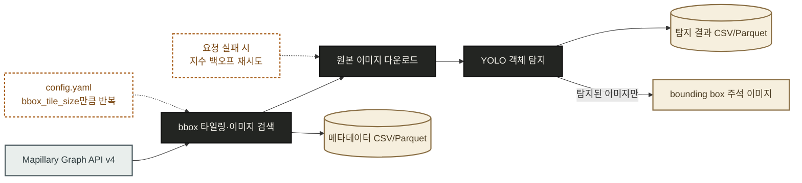
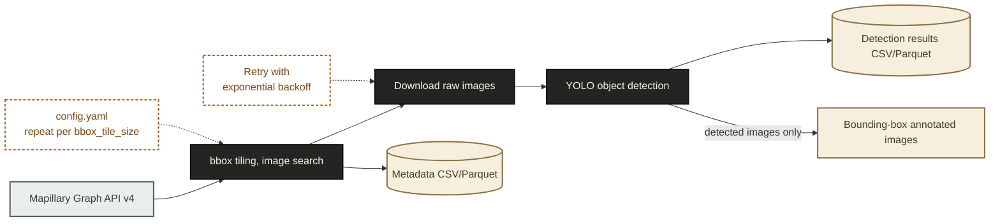

# korea-street-imagery-yolo (한국 스트리트뷰 이미지 YOLO 객체 탐지)

[](requirements.txt)
[](src/detect.py)
[](src/mapillary_client.py)
[](./LICENSE)

[](#korea-street-imagery-yolo-한국-스트리트뷰-이미지-yolo-객체-탐지)
[](#english)

한국 지역의 **Mapillary 공개 street-level imagery**를 수집하고, **YOLO 사전학습 모델**로 차량·사람·자전거 등 객체를 탐지해 결과를 CSV/Parquet과 bounding box 이미지로 저장하는 파이프라인입니다.

## 소개

이 프로젝트는 다음 작업을 자동화합니다.

- **Mapillary Graph API v4**(무료, 공개 API)로 지정한 지역의 street-level 이미지와 촬영일·좌표·방위각 등 메타데이터를 수집합니다.
- **Ultralytics YOLO** 사전학습(COCO) 모델로 `person`, `bicycle`, `car`, `motorcycle`, `bus`, `truck`, `traffic light`, `stop sign` 객체를 탐지합니다.
- 탐지 결과를 이미지 단위가 아닌 **탐지 객체 단위**로 CSV/Parquet에 저장합니다(좌표·신뢰도·클래스·bbox 포함).
- 탐지된 객체마다 **bounding box를 그린 이미지**를 별도로 저장합니다.
- 유료 서비스 없이 **무료·공개 데이터/API만** 사용합니다.

## 동작 원리



지역 bbox가 크면 Mapillary API의 요청당 결과 수 제한에 걸릴 수 있어서, `config.yaml`의 `bbox_tile_size` 값으로 작은 타일로 나눠 순회하며 수집합니다.

## 요구사항

- Python 3.9 이상
- 무료 Mapillary 계정 및 access token
- 이미지 다운로드와 최초 YOLO 가중치 다운로드를 위한 인터넷 연결

## 설치

1. 레포를 받습니다. git 설치 여부에 따라 두 가지 방법 중 하나를 씁니다.

   **방법 A. git으로 클론**

   Windows PowerShell을 열고 입력합니다.

   ```powershell
   git clone https://github.com/ditto-404/korea-street-imagery-yolo.git
   cd korea-street-imagery-yolo
   ```

   **방법 B. ZIP으로 받기**

   - [저장소 페이지](https://github.com/ditto-404/korea-street-imagery-yolo)에 접속합니다.
   - 초록색 **Code** 버튼을 누르고 **Download ZIP**을 클릭합니다.
   - 다운로드된 `korea-street-imagery-yolo-main.zip`을 원하는 위치에 압축 해제합니다.
   - 압축 해제된 `korea-street-imagery-yolo-main` 폴더를 엽니다. 그 폴더 안에서 파일 탐색기 주소창을 클릭하고 `powershell`을 입력한 뒤 Enter를 누르면, 그 폴더를 작업 디렉터리로 하는 PowerShell 창이 열립니다.

   이후 단계는 두 방법 모두 동일합니다.

2. [Mapillary 개발자 대시보드](https://www.mapillary.com/dashboard/developers)에서 무료 계정을 만들고 새 애플리케이션을 등록해 **Client Token**을 발급받습니다.

3. `.env.example` 파일을 `.env`로 복사한 뒤 `MAPILLARY_ACCESS_TOKEN` 값을 방금 발급받은 토큰으로 채웁니다. 커맨드라인 대신 파일 탐색기에서 `.env.example`을 복사해 붙여넣고 파일명을 `.env`로 바꿔도 동일하게 동작합니다.

   ```powershell
   Copy-Item .env.example .env
   ```

가상환경 생성과 의존성 설치는 실행 방법(PowerShell 또는 Jupyter Notebook)에 따라 달라서, 아래 [사용법](#사용법)에서 방법별로 안내합니다.

## 사용법

기본 설정에는 서울 강남, 부산 해운대 두 데모 지역이 들어 있습니다. `config.yaml`의 `regions` 항목에 원하는 지역의 bbox(`[min_lon, min_lat, max_lon, max_lat]`)를 추가하면 다른 지역도 바로 수집할 수 있습니다. 실행 방법은 두 가지입니다.

**방법 A. PowerShell로 실행**

가상환경을 만들고 의존성을 설치합니다.

```powershell
python -m venv .venv
.venv\Scripts\Activate.ps1
pip install -r requirements.txt
```

원하는 명령을 실행합니다.

```powershell
# 특정 지역 이미지 + 메타데이터만 수집
python scripts/collect_imagery.py --region seoul_gangnam

# config.yaml에 정의된 모든 지역 수집
python scripts/collect_imagery.py --all

# 수집된 메타데이터 전체에 대해 YOLO 탐지 실행
python scripts/detect_objects.py --metadata-dir data/metadata

# 수집 + 탐지를 한 번에 실행
python scripts/run_pipeline.py --all
```

**방법 B. Jupyter Notebook으로 실행**

가상환경을 만들거나 `pip install`을 먼저 실행할 필요가 없습니다. Python과 Jupyter가 설치되어 있다면 Jupyter Notebook에서 `notebooks/run_pipeline.ipynb` 파일을 바로 엽니다. 첫 번째 코드 셀이 `requirements.txt`의 의존성을 자동으로 설치합니다. 이후 셀을 위에서부터 순서대로 실행(Shift+Enter)하면 다음을 확인할 수 있습니다.

- `config.yaml` 설정 불러오기
- 지정한 지역의 이미지·메타데이터 수집 결과를 표(DataFrame)로 미리보기
- YOLO 탐지 실행 및 탐지 결과 표, 클래스별 개수 미리보기
- 탐지된 이미지 중 하나를 bounding box와 함께 노트북 안에서 바로 확인


**실행이 끝나면 다음 결과물을 확인할 수 있습니다.**

- `data/metadata/{region}_metadata.csv` / `.parquet`: 이미지별 촬영일, 좌표, 방위각, 로컬 경로
- `data/results/detections/detections.csv` / `.parquet`: 탐지 객체별 클래스, 신뢰도, bbox 좌표, 촬영 좌표/일시
- `data/results/annotated/{image_id}.jpg`: bounding box가 그려진 이미지(탐지된 이미지만)

`detections.csv`의 한 행은 다음과 같은 형태입니다.

| image_id | region | class_name | confidence | x1 | y1 | x2 | y2 | lon | lat | captured_at |
|---|---|---|---|---|---|---|---|---|---|---|
| abc123 | seoul_gangnam | car | 0.87 | 120.4 | 340.1 | 410.2 | 560.9 | 127.031 | 37.498 | 2024-03-12T02:11:00Z |

## 프로젝트 구조

```
.
├── .env.example              # MAPILLARY_ACCESS_TOKEN 입력 템플릿
├── .gitignore
├── config.yaml                # 지역 bbox, YOLO 클래스/threshold 설정
├── requirements.txt
├── notebooks/
│   └── run_pipeline.ipynb      # 수집→탐지→결과 확인을 단계별로 실행하는 노트북
├── src/
│   ├── config.py               # config.yaml 및 .env 로더
│   ├── utils.py                # 로깅 설정, bbox 타일링
│   ├── mapillary_client.py     # Mapillary Graph API v4 클라이언트
│   ├── collect.py              # 이미지·메타데이터 수집 오케스트레이션
│   └── detect.py               # YOLO 탐지, bbox 시각화, CSV/Parquet 저장
├── scripts/
│   ├── collect_imagery.py      # CLI: 지역별 이미지 수집
│   ├── detect_objects.py       # CLI: 수집된 이미지에 YOLO 탐지 실행
│   └── run_pipeline.py         # CLI: 수집+탐지 전체 파이프라인 실행
└── data/
    ├── raw/{region}/*.jpg              # 다운로드된 원본 이미지
    ├── metadata/*_metadata.{csv,parquet}
    └── results/
        ├── detections/detections.{csv,parquet}
        └── annotated/*.jpg
```

| 파일 | 역할 |
|---|---|
| `src/mapillary_client.py` | Mapillary `/images` 엔드포인트 페이지네이션 처리와 이미지 다운로드를 담당합니다. 요청 실패 시 지수 백오프로 재시도해서, 큰 지역을 여러 타일로 순회할 때 일시적인 네트워크 오류로 전체 수집이 중단되지 않게 합니다. |
| `src/collect.py` | bbox 타일링, 중복 이미지 ID 제거, 원본 이미지 저장, 메타데이터 CSV/Parquet 저장을 한 번에 처리합니다. 지역별로 함수를 분리해서(`collect_region` / `collect_all_regions`) 특정 지역만 다시 수집하고 싶을 때도 전체를 다시 돌릴 필요가 없습니다. |
| `src/detect.py` | YOLO 추론, 관심 클래스 필터링, bounding box 시각화, 결과 저장을 담당합니다. 탐지 결과가 있는 이미지에 대해서만 주석 이미지를 생성해 불필요한 디스크 사용을 줄입니다. |
| `config.yaml` | 지역 bbox, 타일 크기, YOLO 모델/threshold/대상 클래스를 코드 수정 없이 바꿀 수 있게 분리했습니다. |
| `notebooks/run_pipeline.ipynb` | `src/collect.py`와 `src/detect.py`를 CLI 대신 노트북 셀에서 직접 호출합니다. 수집된 메타데이터와 탐지 결과를 DataFrame으로, 주석 이미지를 셀 출력으로 바로 확인할 수 있어 지역별 파라미터를 바꿔가며 실험할 때 CLI보다 편리합니다. |

## 한계

- **COCO 사전학습 모델에는 범용 "traffic sign" 클래스가 없습니다.** 가장 가까운 클래스는 `stop sign`뿐이라 `config.yaml`의 `target_classes`에는 `stop sign`을 사용하고 있습니다. 모든 종류의 도로 표지판을 탐지하려면 [Mapillary Traffic Sign Dataset](https://www.mapillary.com/dataset/trafficsign) 같은 표지판 전용 데이터셋으로 별도 파인튜닝이 필요합니다.
- Mapillary API는 요청당 반환 이미지 수에 제한이 있어서, 넓은 지역은 `bbox_tile_size`를 작게 설정할수록 더 촘촘하게 수집되지만 API 요청 수와 실행 시간이 늘어납니다.
- Mapillary 이미지는 Mapillary의 이용약관과 라이선스 조건을 따릅니다. 수집한 이미지나 파생 결과물을 재배포할 계획이라면 [Mapillary 이용약관](https://www.mapillary.com/termsofuse)을 먼저 확인하세요.

## 라이선스

이 저장소의 코드는 [MIT 라이선스](./LICENSE)를 따릅니다. Mapillary에서 수집한 이미지 자체의 라이선스는 별도로 Mapillary의 이용약관을 따릅니다.

---

<a id="english"></a>

## English

[](#korea-street-imagery-yolo-한국-스트리트뷰-이미지-yolo-객체-탐지)
[](#english)

A pipeline that collects **free Mapillary street-level imagery** across Korea and runs a **pretrained YOLO model** to detect vehicles, people, bicycles, and more, saving the results as CSV/Parquet plus bounding-box-annotated images.

### Overview

This project automates the following:

- Collects street-level images and metadata (captured date, coordinates, compass angle) for a chosen area using the **Mapillary Graph API v4** (a free, public API).
- Runs an **Ultralytics YOLO** COCO-pretrained model to detect `person`, `bicycle`, `car`, `motorcycle`, `bus`, `truck`, `traffic light`, and `stop sign`.
- Saves detection results **per detected object** (not per image) to CSV/Parquet, including class, confidence, bbox, and location.
- Saves a **bounding-box-annotated copy** of every image that has at least one detection.
- Uses only **free, public data and APIs**, with no paid services involved.

### How it works



Mapillary's `/images` endpoint caps the number of results per request, so large areas are split into smaller tiles using `bbox_tile_size` in `config.yaml` to get fuller coverage.

### Requirements

- Python 3.9 or later
- A free Mapillary account and access token
- An internet connection, for downloading images and the initial YOLO weights

### Installation

1. Get a copy of the repository. Pick one of the two methods below depending on whether you have git installed.

   **Method A. Clone with git**

   Open Windows PowerShell and enter:

   ```powershell
   git clone https://github.com/ditto-404/korea-street-imagery-yolo.git
   cd korea-street-imagery-yolo
   ```

   **Method B. Download as a ZIP**

   - Go to the [repository page](https://github.com/ditto-404/korea-street-imagery-yolo).
   - Click the green **Code** button, then **Download ZIP**.
   - Extract the downloaded `korea-street-imagery-yolo-main.zip` wherever you like.
   - Open the extracted `korea-street-imagery-yolo-main` folder. Click the address bar in File Explorer, type `powershell`, and press Enter to open a PowerShell window with that folder as its working directory.

   The remaining steps are the same either way.

2. Create a free account and register a new application at the [Mapillary developer dashboard](https://www.mapillary.com/dashboard/developers) to get a **Client Token**.

3. Copy `.env.example` to `.env` and fill in `MAPILLARY_ACCESS_TOKEN` with the token you just created. You can also do this manually in File Explorer by copying `.env.example`, pasting it, and renaming it to `.env`.

   ```powershell
   Copy-Item .env.example .env
   ```

Creating a virtual environment and installing dependencies depends on how you plan to run the pipeline (PowerShell or Jupyter Notebook), so that's covered per method under [Usage](#usage) below.

### Usage

The default configuration includes two demo regions in Korea: Seoul Gangnam and Busan Haeundae. Add more regions to `config.yaml` under `regions` with a bbox (`[min_lon, min_lat, max_lon, max_lat]`) to collect any other area. There are two ways to run it.

**Method A. Run via PowerShell**

Create a virtual environment and install the dependencies.

```powershell
python -m venv .venv
.venv\Scripts\Activate.ps1
pip install -r requirements.txt
```

Run whichever command you need.

```powershell
# Collect images + metadata for one region only
python scripts/collect_imagery.py --region seoul_gangnam

# Collect all regions defined in config.yaml
python scripts/collect_imagery.py --all

# Run YOLO detection over all collected metadata
python scripts/detect_objects.py --metadata-dir data/metadata

# Run collection and detection in one step
python scripts/run_pipeline.py --all
```

**Method B. Run via Jupyter Notebook**

No need to create a virtual environment or run `pip install` first. If Python and Jupyter are already installed, just open `notebooks/run_pipeline.ipynb` in Jupyter Notebook. The first code cell automatically installs the dependencies from `requirements.txt`. Run the remaining cells top to bottom (Shift+Enter) to see:

- Configuration loaded from `config.yaml`
- A preview (DataFrame) of the collected images and metadata for a chosen region
- YOLO detection results and per-class detection counts
- One of the detected images displayed inline with its bounding boxes


**After running, you'll find:**

- `data/metadata/{region}_metadata.csv` / `.parquet`: per-image capture date, coordinates, compass angle, and local path
- `data/results/detections/detections.csv` / `.parquet`: per-detection class, confidence, bbox coordinates, and capture location/time
- `data/results/annotated/{image_id}.jpg`: bounding-box-annotated images (only for images with detections)

A row in `detections.csv` looks like this:

| image_id | region | class_name | confidence | x1 | y1 | x2 | y2 | lon | lat | captured_at |
|---|---|---|---|---|---|---|---|---|---|---|
| abc123 | seoul_gangnam | car | 0.87 | 120.4 | 340.1 | 410.2 | 560.9 | 127.031 | 37.498 | 2024-03-12T02:11:00Z |

### Project structure

```
.
├── .env.example              # MAPILLARY_ACCESS_TOKEN template
├── .gitignore
├── config.yaml                # Region bboxes, YOLO classes/thresholds
├── requirements.txt
├── notebooks/
│   └── run_pipeline.ipynb      # Step-by-step notebook: collect, detect, inspect results
├── src/
│   ├── config.py               # config.yaml and .env loader
│   ├── utils.py                # Logging setup, bbox tiling
│   ├── mapillary_client.py     # Mapillary Graph API v4 client
│   ├── collect.py              # Imagery + metadata collection orchestration
│   └── detect.py               # YOLO detection, bbox visualization, CSV/Parquet output
├── scripts/
│   ├── collect_imagery.py      # CLI: collect imagery for a region
│   ├── detect_objects.py       # CLI: run YOLO detection on collected imagery
│   └── run_pipeline.py         # CLI: run the full collect + detect pipeline
└── data/
    ├── raw/{region}/*.jpg              # Downloaded raw images
    ├── metadata/*_metadata.{csv,parquet}
    └── results/
        ├── detections/detections.{csv,parquet}
        └── annotated/*.jpg
```

| File | Role |
|---|---|
| `src/mapillary_client.py` | Handles pagination of the Mapillary `/images` endpoint and image downloads. Retries with exponential backoff on request failure, so a transient network error while tiling through a large region doesn't abort the whole collection run. |
| `src/collect.py` | Handles bbox tiling, deduplicating image IDs, saving raw images, and writing metadata to CSV/Parquet in one pass. Splitting `collect_region` from `collect_all_regions` lets you re-collect a single region without rerunning everything. |
| `src/detect.py` | Runs YOLO inference, filters to the configured target classes, draws bounding boxes, and saves results. Annotated images are only generated for images that have at least one detection, to avoid wasted disk usage. |
| `config.yaml` | Separates region bboxes, tile size, and YOLO model/threshold/target classes from the code so they can be changed without touching Python files. |
| `notebooks/run_pipeline.ipynb` | Calls `src/collect.py` and `src/detect.py` directly from notebook cells instead of the CLI. Collected metadata and detection results show up as DataFrames and annotated images render as cell output, which is more convenient than the CLI when experimenting with different region parameters. |

### Limitations

- **The COCO-pretrained model has no generic "traffic sign" class.** The closest available class is `stop sign`, which is what `target_classes` in `config.yaml` uses. Detecting the full range of road signs requires fine-tuning on a dedicated sign dataset, such as the [Mapillary Traffic Sign Dataset](https://www.mapillary.com/dataset/trafficsign).
- The Mapillary API limits the number of images returned per request, so a smaller `bbox_tile_size` gives denser coverage of a large area at the cost of more API requests and longer run times.
- Images collected from Mapillary are subject to Mapillary's own terms of use and licensing. Check [Mapillary's terms of use](https://www.mapillary.com/termsofuse) before redistributing collected images or derived results.

### License

The code in this repository is licensed under the [MIT License](./LICENSE). Images collected from Mapillary remain subject to Mapillary's own terms of use.
